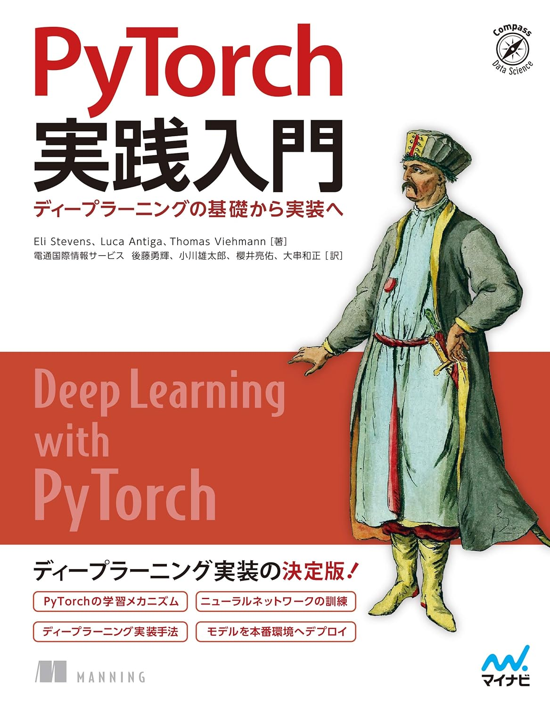

# [PyTorch実践入門: ディープラーニングの基礎から実装へ](https://www.amazon.co.jp/PyTorch%E5%AE%9F%E8%B7%B5%E5%85%A5%E9%96%80-Compass-Books%E3%82%B7%E3%83%AA%E3%83%BC%E3%82%BA-Eli-Stevens-ebook/dp/B08V8HFCPZ/?_encoding=UTF8&pd_rd_w=5jjzQ&content-id=amzn1.sym.283d32d1-edfb-4c41-92c4-67698624ee7b&pf_rd_p=283d32d1-edfb-4c41-92c4-67698624ee7b&pf_rd_r=357-4206083-2768010&pd_rd_wg=kphYw&pd_rd_r=f01a1c2a-fbef-418b-988d-fc70434c48d3&ref_=aufs_ap_sc_dsk)

This repository is for my self-study.